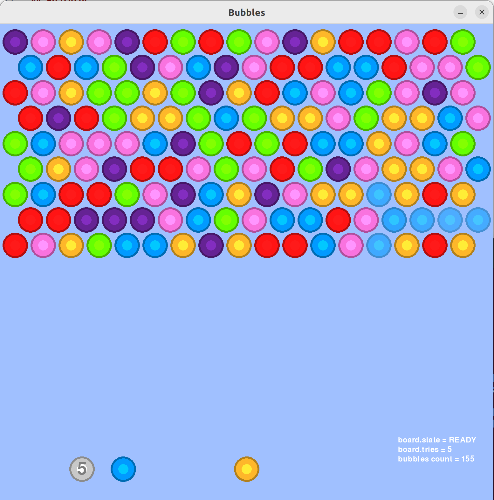

# Bubbles 🔮

A classic **Bubble Shooter** game built with Python and Pygame.


## Overview

Bubbles is a colorful puzzle game where you shoot bubbles to match 3 or more of the same color, causing them to pop. Clear all bubbles to win, but don't let them reach the bottom!



## Features

- **Classic Bubble Shooter mechanics** – Aim and shoot bubbles to create matches
- **6 vibrant bubble colors** – Pink, Red, Purple, Blue, Green, and Orange
- **Hexagonal grid layout** – Bubbles snap to a staggered honeycomb pattern
- **Chain reactions** – Disconnected bubbles fall and pop automatically
- **Progressive difficulty** – New rows advance from the top as you play
- **Visual polish** – Shimmer effects on hover and smooth animations
- **Pause functionality** – Right-click to pause/resume

## Installation

### Requirements

- Python 3.x
- Pygame

### Setup

1. Clone this repository:
   ```bash
   git clone https://github.com/yourusername/marbles.git
   cd marbles
   ```

2. Install Pygame:
   ```bash
   pip install pygame
   ```

3. Run the game:
   ```bash
   python draw.py
   ```

## How to Play

| Action | Control |
|--------|---------|
| Aim | Move mouse |
| Shoot bubble | Left-click |
| Pause/Resume | Right-click |

### Rules

1. **Match 3+** – Connect 3 or more bubbles of the same color to pop them
2. **Clear disconnected bubbles** – Bubbles not connected to the top row will fall
3. **Watch your tries** – After a set number of shots, a new row advances from the top
4. **Win condition** – Clear all bubbles from the board
5. **Lose condition** – Bubbles reach the bottom of the play area

## Configuration

You can tweak game constants at the top of `draw.py`:

| Constant | Default | Description |
|----------|---------|-------------|
| `BUBBLE_SIZE` | 80 | Diameter of each bubble |
| `GRID_WIDTH` | 17 | Number of columns |
| `GRID_HEIGHT` | 17 | Number of rows |
| `INIT_HEIGHT` | 9 | Starting rows of bubbles |
| `SHOW_STATS` | True | Display debug stats on screen |

## Project Structure

```
marbles/
├── draw.py      # Main game file (all game logic)
└── README.md    # This file
```

## License

This project is open source and available under the MIT License.

## Contributing

Feel free to open issues or submit pull requests to improve the game!

---

*Made with 🎮 and Python*
